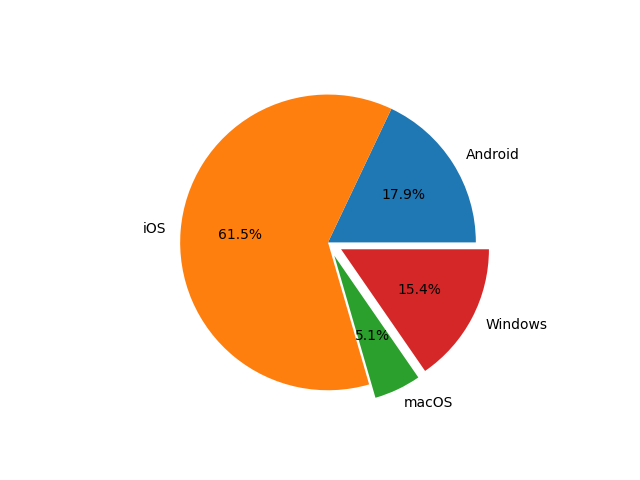
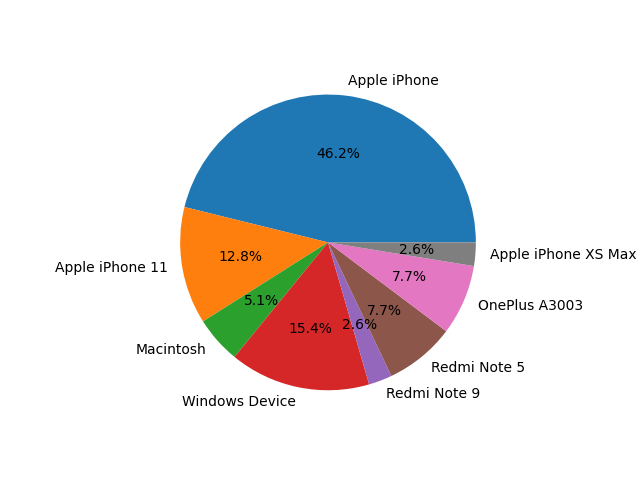
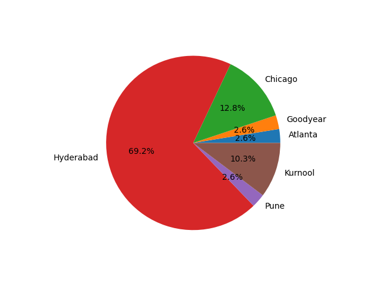

# Server Accesslog Stats

This repo shows the stats of accesslog of the server to my [Dog Breed Classifier API](https://github.com/greysou1/dog-breed-classifier). Check out the web UI at this [website](https://classifythatdog.netlify.app).

<i>Last update: 4th May, 2021 17:38  
(May the 4th be with you)</i>

* [Browsers Pie](#browsers-pie)
* [Operating Systems Pie](#operating-systems-pie)
* [Devices Pie](#devices-pie)
* [Cities Pie](#cities-pie)

## Browsers Pie

## Operating Systems Pie

## Devices Pie

## Cities Pie

## Pewdie Pie

